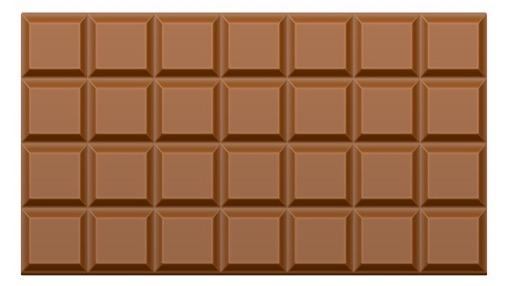

# Discrete Math Problems
## Proofs

1. What are the 4 main styles of proofs?
2. How is an odd number typically represented? How is an even number typically represented?
3. How do you disprove a statement?
4. For each of the following proofs of the statement "0 is an even number", decide if the proof style is one of the 4 styles, or if it is invalid.
    1. 0 is even because it is divisible by 2.
    2. Suppose 0 is not even. Then we can write $0 = 2k+1$, where $k$ is an integer. Isolating for $k$, $k = -1/2$. However, $k$ is no longer an integer. Thus 0 must be even.
5. Given the statement "the square of an even number is even", decide if the provided proof is invalid or not. If it is invalid, describe how it should be improved. If it is valid, name its style of proof.
    1. 2 is even, its square is 4, which is even. 600 is even, and its square is 360,000, which is also even. Thus the statement is proved.
    2. Consider an even number, $2k$, where $k$ is some integer. Its square is $(2k)^2 = 4k^2 = 2(2k^2)$, which is clearly even. Thus the statement is true.
    3. Suppose an even number, $2k$, has an odd square, $2j+1$, where $j$ and $k$ are both integers. Then $(2k)^2 = 2j+1$, and $j = \frac{4k^2 - 1}{2},$. However, the numerator cannot be even, so the fraction is not reducible, and thus $j$ cannot be an integer.   Thus the statement is true.
    4. Suppose a number $a$ has an odd square, $a^2 = 2k+1$, where $k$ is an integer. Isolating for $k$, we find $k = \frac{a^2 - 1}{2}$. The only way $k$ can still be an integer is if a^2 is odd. Thus the statement is true. 

### Prove directly

6. Describe the general strategy to prove something directly.
7. Prove that the product of two odd numbers ($2a+1$ times $2b+1$) is odd.
8. Prove that the sum of any three consecutive numbers (e.g. 1 + 2 + 3;  or 3 + 4 + 5; or 555 + 556 + 557) is always divisible by 3.

### Prove by contrapositive

9. Describe the general strategy to prove something by contrapositive.
10. For every integer $x$, if $x-3$ is odd, then $x+12$ is even.
11. Prove that the square of an odd number ($2n+1$) is odd.

### Prove by contradiction

12. Describe the general strategy to prove something by contradiction.
13. Prove that if today is Tuesday, 100 days from now will be Thursday.
14. Prove that if a number $x$ is rational (able to be represented as a fraction of two integers, i.e. $x = \frac{a}{b}$), and $y$ is irrational (unable to be represented as a fraction of integers), then $x+y$ must be irrational.

### Prove by induction

15. Prove that any amount of money (whole numbers more than $1) can be paid using only $1 or $5 bills.
16. What is the minimum number of breaks needed to break up the following chocolate bar into its individual pieces? Assume $n$ is the height (4) and $m$ is the length (7).

17. What is the minimum number of breaks needed to break up a $n\times m$ chocolate bar into its individual pieces? (assign without loss of generality $n$ to be the vertical variable, $m$ to be the horizontal variable) Prove your number by induction.

### Disprove

18. The sum of two positive odd integers is always prime.
19. The sum of two positive odd integers is never prime.

### Mathemagic

20. Think of a 3-digit number where all digits are the same (e.g. 111, 222). Add up its digits (e.g. 1+1+1), then divide your original number by this value. Prove the answer is 37.
21. Think of any 3-digit number (e.g. 456). Write it twice so it becomes a 6-digit number (e.g. 456456). Divide the number by 7, then 11, then 13. Prove that the result will always be your original number. (Hint: the order of the division is unimportant!)

## Combinatorics

22. Explain the difference between the addition rule and the multiplication rule.
23. Write how to compute the factorial of a positive integer $n$.
24. Write the equation to compute a **combination**, in terms of $n$, the number of items, and $k$, the number of items selected. Does the order of items selected matter in a combination?
25. Write the equation to compute a **permutation**, in terms of $n$, the number of items, and $k$, the number of items selected. Does the order of items selected matter in a permutation?
26. Write about a situation when you would want to compute powers, i.e. $n^k$, instead of a factorial, permutation, or combination.

27. The chair of the CS department says we must select 5 "CS students of the year" from our Algorithms class, and rank them accordingly. There are 4 sophomores, 14 juniors, and 10 seniors currently enrolled. Write the formula to select...
    1. All seniors.
    2. Three seniors, one junior, one sophomore.
    3. At least one sophomore.

28. A hungry group of professional _Settlers of Catan_ players stop at Loard's Ice Cream on the way to their next tournament. Their coach plans to buy each team member a cone. The shop is stocked with 16 flavors. For cones, having chocolate ice cream as the bottom scoop is different from having chocolate as the top scoop. For bowls, it doesn't matter in what order the scoops are added.
    1. If a flavor cannot be chosen more than once, how many possible 3-scoop cones could be ordered?
    2. If a flavor can be chosen more than once, how many possible 5-scoop bowls could be ordered?
    3. If a flavor cannot be chosen more than once, how many possible 4-scoop bowls could be ordered?

29. Midtown Comics is stocking 20 issues of a historic _Spider-Man_ comic run, and you've got first dibs.
    1. You have enough money for 4 comics. You don't want to buy duplicate issues, and don't care about the order in which they go in your bag. How many ways can you choose your comic books?
    2. You have enough money for 6 comics. You are open to buying duplicate issues, and don't care about the order in which they go in your bag. How many ways can you choose your comic books?

30. At your job at Costco, you saw 67 pigeons total over a 4 day period. Prove using the pigeonhole principle that on at least one of these days, you must have seen more than 17 pigeons.

31. There are 28 students in this class. Each of you received an A, B, C, or D on a recent test. Show that there are at least 7 of you who received the same grade.

## Write your own

32. Choose a category of problem and write your own. Then solve it.
